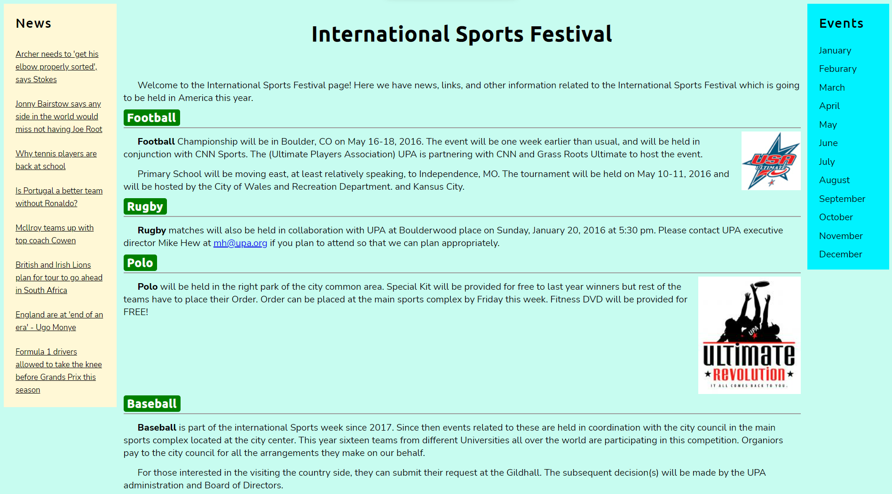

# :scroll: news-page

This is a static news page that I created as **Assignment 1** of my **Web Development** course.

## :heart_eyes: Something Special

This is the project from where **my journey into web development** started :seedling:. And up till the current date when I am writing this README, the journey goes on.

## :art: Look and Feel

Yes, the look and feel of the page is not as good and modern, but this is the required design at that time. And yes, now I can improve its design if I want to. But it reminds me of the time I started my web dev journey. That is why I kept the design as it is up till now.

So there is a reason behind this look.

## :camera_flash: Screen Shot

## :sparkles: Concepts

- [x] HTML5
  - [x] Sementic tags
- [x] CSS3
  - [x] CSS Variables
  - [x] Box Model
  - [x] Positioning
  - [x] Media Queries

## :link: Site Link

[Click Me :slightly_smiling_face:](https://msarmadqadeer.github.io/news-page/) if you want to check out the site.

Code is well structured. Check it out! if you are interested.
